<p align="center">
  
</p>


<h1 align="center">Mailhub</h1>

<p align="center">
  <a href="https://private-mailhub.com">https://private-mailhub.com</a><br><br>
  <b>Protect yout email address from untrusted sites.</b>
</p>
<p align="center">
  <a href="#about">About</a> · <a href="#how-it-works">How It Works</a> · <a href="#architecture">Architecture</a> · <a href="#getting-started">Getting Started</a> · <a href="#security">Security</a>
</p>
<p align="center">
  
  
  
  
</p>

---

# About

Every time you sign up for a newsletter, create an account, or fill out a form, you hand over your email address — and with it, a direct line to your inbox. That address leaked in breaches, and buried under spam. 

Mailhub is an open-source email relay service that stands between your real inbox and the outside world. Instead of giving out your personal email, you generate a unique relay address like `reg1234h@private-mailhub.com`. Emails sent to that address are automatically forwarded to your real inbox. If a relay address starts receiving spam, simply disable it — your real address stays private, untouched, and in your control.

Think of it as a **disposable shield for your inbox**🛡️: use a different relay address for every service, and cut off any address the moment it becomes a problem. No more unsubscribe links that don't work. No more spam you never signed up for.

## Core Values

- **🔒 Privacy** — Your real email address is never exposed to third-party services. All sensitive data is encrypted at rest using AES-256-GCM. We don't read, analyze, or monetize your emails.
- **🔍 Transparency** — Mailhub is fully open source under the [AGPL-3.0 License](LICENSE). Every line of code that handles your email can be audited, reviewed, and verified by anyone.

> **Privacy and transparency are not features — they are the foundation this project is built on.**

<br>

# How It Works

Mailhub acts as an intermediary between external senders and your real inbox. Here's what happens behind the scenes:

1. **You create a relay address** — Sign up and generate a unique address like `shop2024x@private-mailhub.com`. Use it anywhere you'd normally give out your email.

2. **Someone sends you an email** — When an email arrives at your relay address, Mailhub receives it through AWS SES and stores the encrypted content securely.

3. **We forward it to you** — The email is decrypted, processed, and forwarded to your real inbox via Mailgun. The sender never learns your actual email address.

   

4. **You stay in control** — Disable or delete any relay address at any time. Spam from that source stops instantly.

<br>

## Roadmap

- [ ] Block(filter) sender address when its received
- [ ] AI-powered email summarization
- [ ] Enhanced passwordless authentication
- [ ] Enhanced spam detection by AI
- [ ] Browser extension for one-click relay address generation
- [ ] Mobiles apps (iOS/Android)

<br>

# Architecture

Mailhub is built on a robust, event-driven architecture powered by AWS managed services and a NestJS backend.

```mermaid
flowchart LR
    Sender["📧 External Sender"] -->|"relay@private-mailhub.com"| SES

    subgraph AWS["AWS Cloud"]
        SES["SES"] -->|"Encrypt & Store"| S3["S3"]
        SES -->|"Enqueue"| SQS["SQS"]
        RDS["RDS<br/>(MySQL)"]
    end

    subgraph App["NestJS Backend"]
        Worker["Email Worker"]
    end

    SQS -->|"Poll"| Worker
    S3 -->|"Decrypt"| Worker
    RDS -->|"Resolve relay → user"| Worker
    Worker -->|"Forward"| Mailgun["Mailgun"]
    Mailgun --> Inbox["📬 User's Inbox"]
```



## Email Processing Pipeline

| Step | Component | Description |
|------|-----------|-------------|
| 1 | **AWS SES** | Receives inbound email on `@private-mailhub.com` domain |
| 2 | **Amazon S3** | Stores the raw email content with server-side encryption |
| 3 | **Amazon SQS** | Queues the S3 object key for asynchronous processing |
| 4 | **SQS Poller** | NestJS worker polls SQS every 30 seconds via long polling |
| 5 | **Email Parser** | Retrieves encrypted email from S3, decrypts, and extracts metadata |
| 6 | **Relay Resolver** | Looks up the relay address in MySQL to find the user's primary email |
| 7 | **Mailgun API** | Forwards the processed email to the user's real inbox |

<br>

# Tech Stack

| Category | Technology |
|----------|-----------|
| **Runtime** | Node.js, TypeScript |
| **Framework** | NestJS |
| **Database** | MySQL (Amazon RDS) |
| **Cache & Rate Limiting** | Redis |
| **Email Inbound** | Amazon SES |
| **Email Outbound** | Mailgun |
| **Storage** | Amazon S3 |
| **Message Queue** | Amazon SQS |
| **DNS** | Amazon Route 53 |
| **Process Manager** | PM2 |
| **Encryption** | AES-256-GCM |

<br>

# Getting Started

### Prerequisites

- Node.js >= 18.0.0
- MySQL 8.x
- Redis 7.x
- AWS Account (SES, S3, SQS, RDS, Route 53)
- Mailgun Account
- A custom domain with DNS access

### Installation

```bash
# Clone the repository
git clone https://github.com/yourusername/private-mailhub.git
cd private-mailhub

# Install dependencies
npm install

# Configure environment variables
cp .env.example .env
# Edit .env with your AWS credentials, database, Redis, and Mailgun settings

# Run database migrations
npm run migration:run

# Start the application
npm run start:prod
```

### Environment Configuration

Refer to `.env.example` for the full list of required environment variables, including:

- AWS credentials and region configuration
- Database connection settings
- Redis connection settings
- Mailgun API key and domain
- Encryption keys
- Rate limiting thresholds

<br>

# Security

Mailhub takes security seriously. Here's how we protect your data:

- **Encryption at Rest** — All stored email content is encrypted using AES-256-GCM before being written to S3.
- **Email Authentication** — SPF, DKIM, and DMARC records are configured to prevent spoofing and ensure email integrity.
- **Rate Limiting** — Multi-layer rate limiting (per relay address, per IP, per sender) prevents abuse and protects service availability.
- **Spam Detection** — Inbound emails pass through a spam filtering pipeline before forwarding.

## Reporting Vulnerabilities

Security audits and responsible disclosure are welcome. If you discover a vulnerability, please **do not open a public issue**. Instead, email us at [contact@private-mail.com](mailto:contact@private-mail.com) so we can address it promptly.

<br>

# Roadmap

- [ ] AI-powered email summarization
- [ ] Passwordless authentication integration
- [ ] Enhanced spam detection with machine learning
- [ ] Self-hosted deployment guide (Docker)
- [ ] Browser extension for one-click relay address generation

<br>

# License

This project is licensed under the **GNU Affero General Public License v3.0 (AGPL-3.0)**.

This means you are free to view, modify, and distribute the source code, but any modified version that is made available as a network service must also be open-sourced under the same license. This ensures that Mailhub — and any derivative works — remain transparent and open for the community to audit.

See the [LICENSE](LICENSE) file for the full license text.

